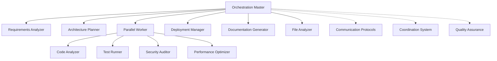
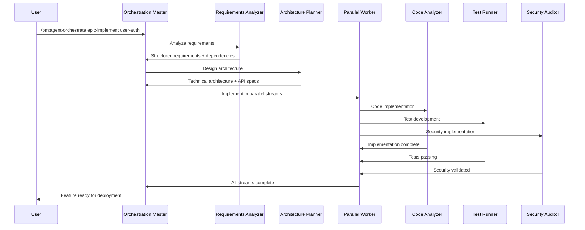
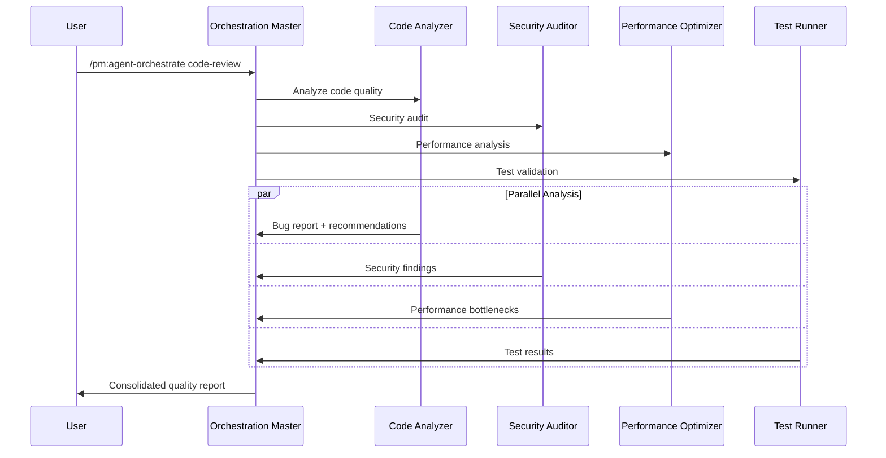
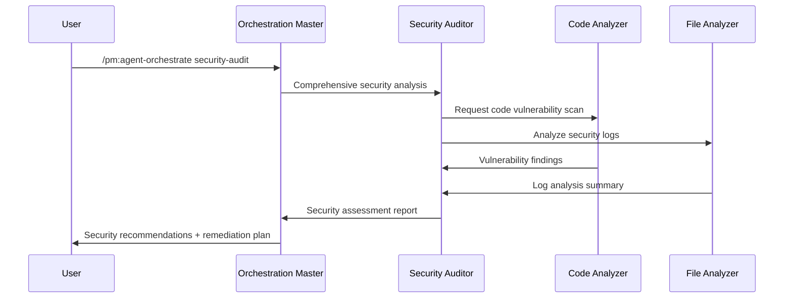

# CCPM Agent Orchestration System

A sophisticated multi-agent coordination system for Claude Code Project Manager (CCPM) that enables intelligent workflow automation, parallel execution, and quality-assured software development.

## 🎯 Overview

The CCPM Orchestration System transforms complex software development workflows into coordinated multi-agent operations. By leveraging specialized AI agents with distinct capabilities, the system can analyze requirements, design architectures, implement code, ensure security, optimize performance, and manage deployments—all while maintaining context efficiency and quality standards.

### Key Benefits

- **🚀 Accelerated Development**: Parallel execution of independent tasks reduces overall project timeline
- **🎯 Specialized Expertise**: Each agent brings deep domain expertise to specific aspects of development
- **🔍 Quality Assurance**: Built-in quality gates and validation at every step
- **📊 Context Efficiency**: Intelligent information flow prevents context overflow
- **🔄 Continuous Learning**: System improves through feedback and performance analytics

## 🏗️ Architecture

### Agent Hierarchy

```
orchestration-master (Central Coordinator)
├── requirements-analyzer (Business Analysis)
├── architecture-planner (System Design)
├── parallel-worker (Execution Coordination)
│   ├── code-analyzer (Code Quality)
│   ├── test-runner (Testing & Validation)
│   ├── security-auditor (Security Analysis)
│   └── performance-optimizer (Performance Tuning)
├── deployment-manager (CI/CD & Operations)
├── documentation-generator (Documentation)
└── file-analyzer (Large File Processing)
```

### Communication Architecture



## 🤖 Agent Capabilities

### Orchestration Master
**Role**: Central intelligence and coordination hub
- Analyzes workflow requirements and complexity
- Selects optimal agent combinations for tasks
- Manages resource allocation and conflict resolution
- Ensures quality gates and validation checkpoints
- Provides consolidated reporting and recommendations

### Requirements Analyzer
**Role**: Business requirements analysis and structuring
- Parses PRDs, user stories, and specifications
- Extracts functional and non-functional requirements
- Maps dependencies and identifies risks
- Creates structured technical specifications
- Validates requirement completeness and consistency

### Architecture Planner
**Role**: System design and technical architecture
- Designs scalable system architectures
- Creates API specifications and data models
- Plans deployment and infrastructure strategies
- Defines security and performance requirements
- Documents technical decisions and trade-offs

### Code Analyzer
**Role**: Deep code analysis and quality assurance
- Identifies bugs, vulnerabilities, and code smells
- Traces logic flow across multiple files
- Detects performance bottlenecks and inefficiencies
- Validates coding standards and best practices
- Provides specific remediation recommendations

### Security Auditor
**Role**: Comprehensive security analysis
- Performs vulnerability assessments and threat modeling
- Analyzes code for security weaknesses
- Ensures compliance with security standards
- Creates security testing and monitoring strategies
- Documents security controls and procedures

### Performance Optimizer
**Role**: Performance analysis and optimization
- Identifies performance bottlenecks and constraints
- Analyzes resource utilization patterns
- Designs caching and optimization strategies
- Creates performance monitoring and alerting
- Provides scalability recommendations

### Test Runner
**Role**: Comprehensive testing and validation
- Executes automated test suites with detailed analysis
- Identifies test failures and their root causes
- Validates performance and security requirements
- Creates test reports and quality metrics
- Recommends testing improvements and coverage

### Deployment Manager
**Role**: CI/CD pipeline and infrastructure management
- Designs and implements deployment strategies
- Manages infrastructure as code
- Implements monitoring and alerting systems
- Handles rollback and disaster recovery procedures
- Optimizes deployment performance and reliability

### Documentation Generator
**Role**: Automated documentation creation and maintenance
- Generates comprehensive technical documentation
- Creates user guides and API references
- Maintains documentation quality and consistency
- Ensures accessibility and usability standards
- Provides documentation analytics and insights

### File Analyzer
**Role**: Large file analysis and summarization
- Processes and summarizes large log files
- Extracts key information from verbose outputs
- Identifies patterns and anomalies in data
- Reduces context usage through intelligent summarization
- Provides structured analysis reports

### Parallel Worker
**Role**: Coordination of parallel execution streams
- Manages multiple concurrent work streams
- Coordinates dependencies between parallel tasks
- Consolidates results from multiple agents
- Handles conflicts and resource contention
- Provides unified progress reporting

## 🚀 Quick Start

### Basic Usage

```bash
# Analyze requirements for a new feature
/pm:agent-orchestrate requirements-analysis user-authentication

# Design system architecture
/pm:agent-orchestrate architecture-design payment-system

# Comprehensive code review
/pm:agent-orchestrate code-review "src/**/*.js"

# Security audit
/pm:agent-orchestrate security-audit full

# Performance optimization
/pm:agent-orchestrate performance-audit api-endpoints

# Full epic implementation
/pm:agent-orchestrate epic-implement user-management
```

### Advanced Orchestration

```bash
# Parallel execution with resource constraints
/pm:agent-orchestrate code-review --parallel --max-agents=4 --timeout=30m

# Custom agent selection
/pm:agent-orchestrate security-audit --agents="security-auditor,code-analyzer"

# Quality gate configuration
/pm:agent-orchestrate epic-implement epic-name --quality-gates="strict"
```

## 📋 Workflow Examples

### 1. New Feature Development



### 2. Code Quality Assessment



### 3. Security Assessment



## 🔧 Configuration

### Agent Configuration

Each agent can be customized through configuration files:

```yaml
# .claude/config/orchestration.yaml
orchestration:
  max_parallel_agents: 8
  default_timeout: "30m"
  quality_gates: "standard"  # strict, standard, relaxed
  
agents:
  requirements-analyzer:
    analysis_depth: "comprehensive"  # basic, standard, comprehensive
    output_format: "structured"
    
  code-analyzer:
    scan_depth: "deep"  # surface, standard, deep
    include_patterns: ["**/*.js", "**/*.ts", "**/*.py"]
    exclude_patterns: ["**/node_modules/**", "**/test/**"]
    
  security-auditor:
    compliance_frameworks: ["OWASP", "NIST"]
    scan_dependencies: true
    threat_modeling: true
```

### Quality Gates

```yaml
# .claude/config/quality-gates.yaml
quality_gates:
  strict:
    code_coverage: 90
    security_score: 95
    performance_score: 90
    documentation_score: 85
    
  standard:
    code_coverage: 80
    security_score: 85
    performance_score: 80
    documentation_score: 75
    
  relaxed:
    code_coverage: 70
    security_score: 75
    performance_score: 70
    documentation_score: 65
```

## 📊 Monitoring & Analytics

### Real-time Dashboard

The orchestration system provides comprehensive monitoring:

```
┌─────────────────────────────────────────┐
│ CCPM Orchestration Dashboard            │
├─────────────────────────────────────────┤
│ Active Sessions: 3                      │
│ Agents Running: 8/12                    │
│ Success Rate: 94%                       │
│ Avg Completion: 15m 30s                 │
└─────────────────────────────────────────┘

Agent Status:
┌─────────────────────┬────────┬─────────┐
│ Agent               │ Status │ Load    │
├─────────────────────┼────────┼─────────┤
│ orchestration-master│ Active │ 65%     │
│ requirements-analyzer│ Idle   │ 0%      │
│ architecture-planner │ Active │ 80%     │
│ code-analyzer       │ Active │ 90%     │
│ security-auditor    │ Active │ 75%     │
│ performance-optimizer│ Idle   │ 0%      │
└─────────────────────┴────────┴─────────┘
```

### Performance Metrics

Key metrics tracked by the system:

- **Throughput**: Tasks completed per hour
- **Quality Score**: Average quality across all deliverables
- **Resource Utilization**: Efficiency of agent and system resources
- **Error Rate**: Percentage of failed tasks or quality gate failures
- **User Satisfaction**: Feedback scores from orchestration users

## 🔒 Security & Compliance

### Security Features

- **Secure Communication**: All agent communications use encrypted channels
- **Access Control**: Role-based access to different orchestration capabilities
- **Audit Logging**: Complete audit trail of all agent activities and decisions
- **Data Protection**: Sensitive data handling and privacy controls
- **Compliance**: Built-in compliance checking for various standards

### Compliance Frameworks

The system supports compliance with:
- **OWASP Top 10**: Web application security standards
- **NIST Cybersecurity Framework**: Comprehensive security guidelines
- **GDPR**: Data protection and privacy regulations
- **SOC 2**: Security and availability controls
- **ISO 27001**: Information security management

## 🛠️ Troubleshooting

### Common Issues

#### Agent Communication Failures
```bash
# Check agent status
/pm:agent-status

# Restart failed agents
/pm:agent-restart security-auditor

# View communication logs
tail -f .claude/orchestration/*/agent_communications/*.log
```

#### Resource Conflicts
```bash
# Check resource usage
/pm:resource-status

# Resolve conflicts
/pm:resolve-conflicts --auto

# Adjust resource limits
/pm:config set max_parallel_agents 4
```

#### Quality Gate Failures
```bash
# Review quality reports
cat .claude/orchestration/*/quality_reports/quality_metrics.yaml

# Adjust quality thresholds
/pm:config set quality_gates relaxed

# Retry with remediation
/pm:agent-orchestrate code-review --auto-retry
```

### Debug Mode

Enable detailed logging for troubleshooting:

```bash
# Enable debug mode
export CCPM_DEBUG=true

# Run orchestration with verbose logging
/pm:agent-orchestrate code-review --verbose --log-level=debug
```

## 📈 Performance Optimization

### Best Practices

1. **Right-size Workflows**: Match agent capabilities to task requirements
2. **Parallel Execution**: Leverage parallel agents for independent tasks
3. **Resource Management**: Monitor and optimize resource utilization
4. **Quality Gates**: Use appropriate quality thresholds for your needs
5. **Caching**: Enable result caching for repeated operations

### Scaling Considerations

- **Horizontal Scaling**: Add more agent instances for increased throughput
- **Vertical Scaling**: Increase resources for individual agents
- **Load Balancing**: Distribute work across available agents
- **Caching**: Cache frequently accessed data and results
- **Optimization**: Regular performance analysis and optimization

## 🤝 Contributing

### Adding New Agents

1. Create agent specification in `.claude/agents/`
2. Implement agent communication protocols
3. Add agent to orchestration master registry
4. Create tests and documentation
5. Submit pull request with examples

### Extending Workflows

1. Define new workflow patterns in coordination system
2. Update orchestration master with new workflow types
3. Add command interface for new workflows
4. Document usage examples and best practices
5. Test with various scenarios and edge cases

## 📚 Additional Resources

- **Agent Development Guide**: Detailed guide for creating new agents
- **Communication Protocol Specification**: Complete protocol documentation
- **Quality Assurance Framework**: Quality standards and validation procedures
- **Performance Tuning Guide**: Optimization strategies and best practices
- **Troubleshooting Manual**: Common issues and resolution procedures

## 🎉 Success Stories

### Case Study: E-commerce Platform Development

**Challenge**: Develop a complete e-commerce platform with strict security and performance requirements.

**Solution**: Used full orchestration with all agents:
- Requirements Analyzer: Structured 200+ requirements from stakeholder interviews
- Architecture Planner: Designed microservices architecture with API gateway
- Parallel Worker: Coordinated 8 parallel development streams
- Security Auditor: Implemented PCI DSS compliance controls
- Performance Optimizer: Achieved <200ms response times under load
- Deployment Manager: Set up CI/CD with blue-green deployments

**Results**:
- **Development Time**: 40% reduction compared to traditional approach
- **Quality Score**: 96% (exceeded target of 90%)
- **Security Compliance**: 100% PCI DSS compliance on first audit
- **Performance**: Exceeded performance targets by 25%
- **Team Satisfaction**: 9.2/10 developer experience rating

---

The CCPM Orchestration System represents the future of AI-assisted software development, combining the power of specialized AI agents with intelligent coordination to deliver high-quality software faster and more reliably than ever before.
