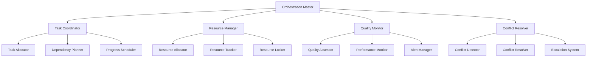

# Agent Coordination System

This document defines the comprehensive coordination system for CCPM agents, including orchestration patterns, conflict resolution, resource management, and quality assurance mechanisms.

## Coordination Architecture

### System Components



### Coordination Layers

#### 1. Strategic Layer (Orchestration Master)
- **Responsibility**: High-level workflow planning and agent selection
- **Scope**: Cross-project coordination and resource allocation
- **Timeframe**: Long-term (hours to days)

#### 2. Tactical Layer (Task Coordination)
- **Responsibility**: Task decomposition and dependency management
- **Scope**: Within-project task coordination
- **Timeframe**: Medium-term (minutes to hours)

#### 3. Operational Layer (Agent Execution)
- **Responsibility**: Individual task execution and status reporting
- **Scope**: Single agent operations
- **Timeframe**: Short-term (seconds to minutes)

## Orchestration Patterns

### Pattern 1: Sequential Chain
```yaml
sequential_chain:
  description: "Tasks executed in strict sequence with handoffs"
  use_cases:
    - "Requirements → Architecture → Implementation"
    - "Analysis → Design → Testing"
  
  coordination_flow:
    1. agent_a_completes: "Produces output artifacts"
    2. validation_gate: "Orchestrator validates completion"
    3. context_handoff: "Relevant context passed to next agent"
    4. agent_b_starts: "Next agent begins with validated input"
  
  advantages:
    - "Clear dependencies and handoffs"
    - "Easier to debug and trace"
    - "Predictable resource usage"
  
  disadvantages:
    - "Longer overall execution time"
    - "Blocking on single agent failures"
    - "Underutilized parallel capacity"
```

### Pattern 2: Parallel Execution
```yaml
parallel_execution:
  description: "Independent tasks executed simultaneously"
  use_cases:
    - "Code analysis + Security audit + Performance testing"
    - "Multiple feature implementations"
  
  coordination_flow:
    1. work_decomposition: "Break work into independent streams"
    2. resource_allocation: "Assign resources to each stream"
    3. parallel_launch: "Start all agents simultaneously"
    4. progress_monitoring: "Track all streams independently"
    5. result_consolidation: "Merge results when all complete"
  
  advantages:
    - "Faster overall execution"
    - "Better resource utilization"
    - "Fault isolation between streams"
  
  disadvantages:
    - "Complex coordination requirements"
    - "Potential resource conflicts"
    - "Difficult result consolidation"
```

### Pattern 3: Pipeline Processing
```yaml
pipeline_processing:
  description: "Continuous flow with overlapping execution"
  use_cases:
    - "Continuous integration/deployment"
    - "Batch processing workflows"
  
  coordination_flow:
    1. stage_definition: "Define pipeline stages and buffers"
    2. continuous_feed: "Feed work items into pipeline"
    3. stage_processing: "Each stage processes and passes forward"
    4. flow_control: "Manage backpressure and throughput"
    5. output_collection: "Collect completed items"
  
  advantages:
    - "Continuous throughput"
    - "Efficient resource utilization"
    - "Scalable processing capacity"
  
  disadvantages:
    - "Complex flow control"
    - "Difficult error handling"
    - "State management complexity"
```

### Pattern 4: Event-Driven Coordination
```yaml
event_driven:
  description: "Agents react to events and state changes"
  use_cases:
    - "Monitoring and alerting workflows"
    - "Reactive system maintenance"
  
  coordination_flow:
    1. event_detection: "Monitor for triggering events"
    2. agent_selection: "Choose appropriate response agents"
    3. context_enrichment: "Add relevant context to event"
    4. agent_activation: "Activate selected agents"
    5. response_coordination: "Coordinate agent responses"
  
  advantages:
    - "Responsive to changing conditions"
    - "Efficient resource usage"
    - "Natural scalability"
  
  disadvantages:
    - "Complex event management"
    - "Difficult to predict behavior"
    - "Potential event storms"
```

## Resource Management

### Resource Types
```yaml
resource_categories:
  computational:
    - cpu_cores: "Processing capacity for agent execution"
    - memory: "RAM for agent operations and data processing"
    - storage: "Disk space for temporary files and artifacts"
    - network: "Bandwidth for external API calls and data transfer"
  
  external_services:
    - github_api: "GitHub API rate limits and access tokens"
    - claude_api: "Claude API usage limits and quotas"
    - database_connections: "Database connection pool limits"
    - third_party_apis: "External service rate limits"
  
  shared_artifacts:
    - source_code: "Read/write access to codebase"
    - documentation: "Access to project documentation"
    - configuration_files: "System and application configurations"
    - test_data: "Shared test datasets and fixtures"
  
  coordination_resources:
    - agent_slots: "Maximum concurrent agent instances"
    - communication_channels: "Message queues and communication paths"
    - coordination_locks: "Mutual exclusion for critical sections"
    - priority_queues: "Task prioritization and scheduling"
```

### Resource Allocation Strategy
```yaml
allocation_strategy:
  priority_based:
    critical_tasks: "80% of available resources"
    high_priority: "15% of available resources"
    normal_priority: "5% of available resources"
  
  fair_share:
    base_allocation: "Minimum guaranteed resources per agent"
    burst_capacity: "Additional resources when available"
    preemption_rules: "When higher priority tasks need resources"
  
  adaptive_allocation:
    performance_monitoring: "Track resource efficiency per agent"
    dynamic_adjustment: "Reallocate based on performance metrics"
    learning_algorithm: "Improve allocation over time"
```

### Resource Conflict Resolution
```yaml
conflict_resolution:
  detection_mechanisms:
    - resource_reservation: "Agents declare resource needs upfront"
    - usage_monitoring: "Real-time tracking of resource consumption"
    - conflict_prediction: "Predict conflicts before they occur"
  
  resolution_strategies:
    serialization:
      description: "Execute conflicting operations sequentially"
      use_case: "File modifications, database updates"
      implementation: "Queue conflicting operations with locks"
    
    resource_sharing:
      description: "Allow controlled shared access to resources"
      use_case: "Read-only access to shared files"
      implementation: "Reader-writer locks and access controls"
    
    alternative_resources:
      description: "Use alternative resources when primary is unavailable"
      use_case: "Backup API endpoints, mirror databases"
      implementation: "Fallback resource pools and routing"
    
    priority_preemption:
      description: "Higher priority tasks can preempt lower priority ones"
      use_case: "Critical security fixes, production incidents"
      implementation: "Priority queues and preemption policies"
```

## Quality Assurance Framework

### Quality Metrics
```yaml
quality_dimensions:
  completeness:
    definition: "All required deliverables produced"
    measurement: "Percentage of deliverables completed"
    threshold: "100% for critical tasks, 95% for normal tasks"
  
  correctness:
    definition: "Deliverables meet specified requirements"
    measurement: "Validation test pass rate"
    threshold: "95% pass rate for all validations"
  
  timeliness:
    definition: "Tasks completed within allocated timeframes"
    measurement: "Percentage of tasks meeting deadlines"
    threshold: "90% of tasks complete on time"
  
  efficiency:
    definition: "Optimal use of allocated resources"
    measurement: "Resource utilization vs. baseline"
    threshold: "Within 20% of optimal resource usage"
  
  consistency:
    definition: "Consistent quality across similar tasks"
    measurement: "Standard deviation of quality scores"
    threshold: "Standard deviation < 10% of mean quality"
```

### Quality Gates
```yaml
quality_gates:
  task_initiation:
    validations:
      - "Required inputs available and validated"
      - "Agent has necessary capabilities for task"
      - "Resources allocated and reserved"
      - "Dependencies satisfied or scheduled"
    
    failure_actions:
      - "Block task execution until validations pass"
      - "Notify orchestration master of blocking issues"
      - "Suggest alternative approaches or agents"
  
  progress_checkpoints:
    frequency: "25%, 50%, 75% completion milestones"
    validations:
      - "Progress aligns with estimated timeline"
      - "Intermediate deliverables meet quality standards"
      - "Resource usage within expected bounds"
      - "No critical issues or blockers identified"
    
    failure_actions:
      - "Trigger corrective actions or resource reallocation"
      - "Escalate to orchestration master if needed"
      - "Adjust timeline or scope if necessary"
  
  task_completion:
    validations:
      - "All deliverables produced and validated"
      - "Quality metrics meet defined thresholds"
      - "Handoff requirements satisfied"
      - "Documentation and artifacts properly stored"
    
    failure_actions:
      - "Reject completion and request remediation"
      - "Trigger quality improvement process"
      - "Document lessons learned for future tasks"
```

### Continuous Improvement
```yaml
improvement_mechanisms:
  performance_analytics:
    data_collection:
      - "Task execution times and resource usage"
      - "Quality scores and failure rates"
      - "Agent performance metrics and trends"
      - "User satisfaction and feedback scores"
    
    analysis_methods:
      - "Statistical analysis of performance trends"
      - "Root cause analysis of failures and delays"
      - "Comparative analysis across agents and tasks"
      - "Predictive modeling for capacity planning"
    
    improvement_actions:
      - "Agent capability enhancement recommendations"
      - "Process optimization and automation opportunities"
      - "Resource allocation and scheduling improvements"
      - "Training and development priorities"
  
  feedback_loops:
    agent_feedback:
      - "Agents report on task difficulty and resource adequacy"
      - "Suggestions for process improvements and optimizations"
      - "Identification of recurring issues and bottlenecks"
    
    user_feedback:
      - "Quality assessments of delivered work products"
      - "Satisfaction with timeliness and communication"
      - "Suggestions for enhanced capabilities and features"
    
    system_feedback:
      - "Automated detection of performance anomalies"
      - "Resource utilization optimization opportunities"
      - "Coordination efficiency improvements"
```

## Coordination Algorithms

### Task Scheduling Algorithm
```python
class TaskScheduler:
    def schedule_tasks(self, task_queue, available_agents, resources):
        """
        Advanced task scheduling with multiple optimization criteria
        """
        # Priority-based scheduling with resource constraints
        scheduled_tasks = []
        
        # Sort tasks by priority, deadline, and dependencies
        prioritized_tasks = self.prioritize_tasks(task_queue)
        
        for task in prioritized_tasks:
            # Find suitable agents for this task
            suitable_agents = self.find_suitable_agents(task, available_agents)
            
            if not suitable_agents:
                # No suitable agents available, defer task
                self.defer_task(task, "No suitable agents available")
                continue
            
            # Select optimal agent based on multiple criteria
            selected_agent = self.select_optimal_agent(
                task, suitable_agents, resources
            )
            
            # Check resource availability and conflicts
            if self.check_resource_availability(task, selected_agent, resources):
                # Reserve resources and schedule task
                self.reserve_resources(task, selected_agent, resources)
                scheduled_tasks.append((task, selected_agent))
                available_agents.remove(selected_agent)
            else:
                # Resources not available, defer or find alternatives
                self.handle_resource_conflict(task, selected_agent, resources)
        
        return scheduled_tasks
    
    def select_optimal_agent(self, task, agents, resources):
        """
        Multi-criteria agent selection optimization
        """
        scores = {}
        
        for agent in agents:
            score = 0
            
            # Capability match score (40% weight)
            capability_score = self.calculate_capability_match(task, agent)
            score += capability_score * 0.4
            
            # Current workload score (30% weight)
            workload_score = self.calculate_workload_score(agent)
            score += workload_score * 0.3
            
            # Historical performance score (20% weight)
            performance_score = self.get_historical_performance(agent, task.type)
            score += performance_score * 0.2
            
            # Resource efficiency score (10% weight)
            efficiency_score = self.calculate_resource_efficiency(agent, task)
            score += efficiency_score * 0.1
            
            scores[agent] = score
        
        # Return agent with highest score
        return max(scores.items(), key=lambda x: x[1])[0]
```

### Dependency Resolution Algorithm
```python
class DependencyResolver:
    def resolve_dependencies(self, tasks):
        """
        Topological sort with cycle detection for task dependencies
        """
        # Build dependency graph
        graph = self.build_dependency_graph(tasks)
        
        # Detect cycles
        cycles = self.detect_cycles(graph)
        if cycles:
            raise DependencyError(f"Circular dependencies detected: {cycles}")
        
        # Perform topological sort
        execution_order = self.topological_sort(graph)
        
        # Identify parallel execution opportunities
        parallel_groups = self.identify_parallel_groups(execution_order, graph)
        
        return parallel_groups
    
    def identify_parallel_groups(self, execution_order, graph):
        """
        Group tasks that can execute in parallel
        """
        parallel_groups = []
        remaining_tasks = set(execution_order)
        
        while remaining_tasks:
            # Find tasks with no unresolved dependencies
            ready_tasks = []
            for task in remaining_tasks:
                if self.all_dependencies_resolved(task, graph, remaining_tasks):
                    ready_tasks.append(task)
            
            if not ready_tasks:
                raise DependencyError("Deadlock detected in dependency resolution")
            
            # Group ready tasks for parallel execution
            parallel_groups.append(ready_tasks)
            remaining_tasks -= set(ready_tasks)
        
        return parallel_groups
```

### Conflict Detection Algorithm
```python
class ConflictDetector:
    def detect_conflicts(self, scheduled_tasks, resources):
        """
        Proactive conflict detection across multiple dimensions
        """
        conflicts = []
        
        # Resource conflicts
        resource_conflicts = self.detect_resource_conflicts(scheduled_tasks, resources)
        conflicts.extend(resource_conflicts)
        
        # Temporal conflicts
        temporal_conflicts = self.detect_temporal_conflicts(scheduled_tasks)
        conflicts.extend(temporal_conflicts)
        
        # Data conflicts
        data_conflicts = self.detect_data_conflicts(scheduled_tasks)
        conflicts.extend(data_conflicts)
        
        # Capability conflicts
        capability_conflicts = self.detect_capability_conflicts(scheduled_tasks)
        conflicts.extend(capability_conflicts)
        
        return conflicts
    
    def detect_resource_conflicts(self, tasks, resources):
        """
        Detect overlapping resource usage that exceeds capacity
        """
        conflicts = []
        resource_usage = defaultdict(list)
        
        # Map resource usage by time windows
        for task, agent in tasks:
            for resource, amount in task.resource_requirements.items():
                time_window = (task.start_time, task.end_time)
                resource_usage[resource].append((time_window, amount, task))
        
        # Check for conflicts in each resource
        for resource, usage_list in resource_usage.items():
            capacity = resources[resource].capacity
            conflicts.extend(
                self.find_overlapping_usage(usage_list, capacity, resource)
            )
        
        return conflicts
```

## Monitoring and Observability

### Real-time Dashboards
```yaml
coordination_dashboard:
  agent_status_panel:
    metrics:
      - "Active agents and their current tasks"
      - "Agent utilization and performance scores"
      - "Queue lengths and wait times"
      - "Error rates and failure patterns"
    
    visualizations:
      - "Agent activity timeline"
      - "Resource utilization heatmap"
      - "Task flow diagram"
      - "Performance trend charts"
  
  system_health_panel:
    metrics:
      - "Overall system throughput and latency"
      - "Resource utilization across all categories"
      - "Quality scores and SLA compliance"
      - "Coordination efficiency metrics"
    
    alerts:
      - "Resource exhaustion warnings"
      - "Agent failure notifications"
      - "Quality threshold violations"
      - "Deadline risk alerts"
  
  coordination_flow_panel:
    metrics:
      - "Task progression through workflow stages"
      - "Dependency resolution status"
      - "Parallel execution efficiency"
      - "Handoff success rates"
    
    visualizations:
      - "Workflow state diagram"
      - "Dependency graph visualization"
      - "Parallel execution timeline"
      - "Communication flow diagram"
```

### Performance Metrics
```yaml
coordination_kpis:
  efficiency_metrics:
    task_throughput: "Tasks completed per unit time"
    resource_utilization: "Percentage of resources actively used"
    parallel_efficiency: "Speedup achieved through parallelization"
    coordination_overhead: "Time spent on coordination vs. execution"
  
  quality_metrics:
    task_success_rate: "Percentage of tasks completed successfully"
    quality_score_average: "Average quality score across all deliverables"
    rework_rate: "Percentage of tasks requiring rework"
    customer_satisfaction: "User satisfaction with delivered work"
  
  reliability_metrics:
    system_availability: "Percentage of time system is operational"
    mean_time_to_failure: "Average time between system failures"
    mean_time_to_recovery: "Average time to recover from failures"
    error_rate: "Percentage of operations that result in errors"
  
  scalability_metrics:
    agent_scaling_efficiency: "How well system scales with more agents"
    task_scaling_efficiency: "How well system handles increased task load"
    resource_scaling_efficiency: "How efficiently additional resources are utilized"
    coordination_complexity: "How coordination overhead scales with system size"
```

This coordination system ensures efficient, reliable, and scalable orchestration of CCPM agents while maintaining high quality standards and optimal resource utilization.
